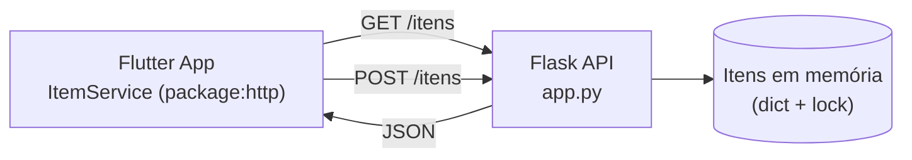

# LAMD App

> Aplicativo Flutter de exemplo desenvolvido para o Lab 07 (Introdução ao Flutter) da disciplina LAMD 60445, consumindo uma API REST em Flask para listar e cadastrar itens.

---

## Stack

### Mobile


### Backend


---

## Sumário

- [Sobre o projeto](#sobre-o-projeto)
- [Funcionalidades](#funcionalidades)
- [Arquitetura](#arquitetura)
- [Estrutura do repositório](#estrutura-do-repositório)
- [Como executar](#como-executar)
- [Documentação e reflexão](#documentação-e-reflexão)
- [Autor](#autor)

---

## Sobre o projeto

O **LAMD App** é o material prático do **Lab 07 — Introdução ao Flutter**, da disciplina LAMD 60445 (Engenharia de Software, PUC Minas). O objetivo é exercitar, na prática, os conceitos centrais do Flutter — widgets `Stateless` vs. `Stateful`, gerenciamento de estado com `setState`, navegação entre telas e consumo assíncrono de uma API REST — construindo um app simples de cadastro de itens.

O projeto é composto por duas partes:

- **App Flutter** (`lib/`): interface mobile com listagem, cadastro e atualização de itens, consumindo a API via `package:http`.
- **Backend Flask de referência** (`backend/app.py`): API REST em memória que simula o servidor do Lab 05/06, usada apenas para o app ter dados para consumir durante o laboratório.

---

## Funcionalidades

| Tela / Widget | O que faz |
|---|---|
| **Lista de Itens** (`lista_itens_screen.dart`) | Busca os itens no servidor via `FutureBuilder`, trata os estados de carregamento, erro e lista vazia, e permite recarregar via *pull-to-refresh* ou botão |
| **Novo Item** (`novo_item_screen.dart`) | Formulário validado (nome e preço) que cria um item via `POST /itens` e retorna à lista já atualizada |
| **Contador** (`contador_widget.dart`) | Exemplo isolado de `StatefulWidget` para demonstrar `setState` e rebuild local |
| **Item Card** (`item_card.dart`) | Exemplo de `StatelessWidget` puro, renderizando nome e preço recebidos por parâmetro |

---

## Arquitetura

Comunicação simples cliente-servidor via HTTP/JSON: o app Flutter faz requisições REST para o backend Flask, que mantém os itens em um dicionário em memória (protegido por lock para acesso concorrente).



No emulador Android, o app acessa o backend via `http://10.0.2.2:5000`; em dispositivo físico, é necessário usar o IP da máquina host na rede local.

---

## Estrutura do repositório

```
lamd_app/
├── lib/
│   ├── main.dart
│   ├── screens/
│   │   ├── lista_itens_screen.dart
│   │   └── novo_item_screen.dart
│   ├── services/
│   │   └── item_service.dart
│   └── widgets/
│       ├── contador_widget.dart
│       └── item_card.dart
├── backend/
│   ├── app.py            # API Flask de referência (itens em memória)
│   └── smoke_test.py     # Script de verificação da API antes de abrir o app
├── test/
│   └── widget_test.dart
├── android/ · ios/ · linux/ · macos/ · windows/ · web/   # projetos de plataforma gerados pelo Flutter
├── image/
│   ├── banner.png
│   └── banner-institucional.svg
├── reflexao.md            # Respostas da reflexão do Lab 07
└── lab07_reflexao.md       # Roteiro/template de reflexão do Lab 07
```

---

## Como executar

### Pré-requisitos

- Flutter SDK 3.11+
- Python 3 com `flask` e `flask-cors`

### 1. Backend Flask

```bash
cd backend
pip install flask flask-cors
python app.py           # API em http://0.0.0.0:5000
```

Opcionalmente, valide a API antes de abrir o app:

```bash
python smoke_test.py
```

### 2. App Flutter

```bash
flutter pub get
flutter run
```

> No emulador Android, o `ItemService` já aponta para `http://10.0.2.2:5000`. Em dispositivo físico, atualize `_baseUrl` em `lib/services/item_service.dart` para o IP da máquina na rede local.

---

## Documentação e reflexão

| Documento | Conteúdo |
|---|---|
| [`lab07_reflexao.md`](lab07_reflexao.md) | Roteiro de reflexão do Lab 07 (perguntas sobre widgets, ciclo de vida, MVC, concorrência e serialização) |
| [`reflexao.md`](reflexao.md) | Respostas dissertativas às perguntas do roteiro |

---

## Autor

| Nome | GitHub |
|---|---|
| Marcos Alberto Ferreira Pinto | [@marcosffp](https://github.com/marcosffp) |

_Curso de Engenharia de Software — LAMD 60445_
_Pontifícia Universidade Católica de Minas Gerais (PUC MINAS)_

---

<div align="center">
  
</div>
<p align="center">Fonte do banner: <a href="https://github.com/joaopauloaramuni">João Paulo Carneiro Aramuni</a></p>

---